# Orchestrator Flow Diagrams

## Signal Processing Flow

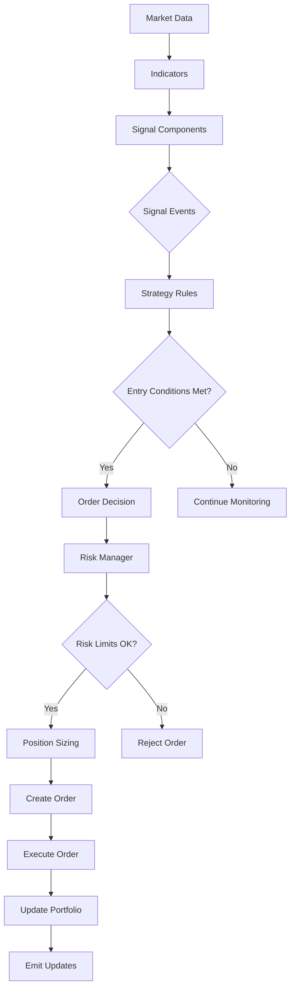

## Backtest Execution Flow

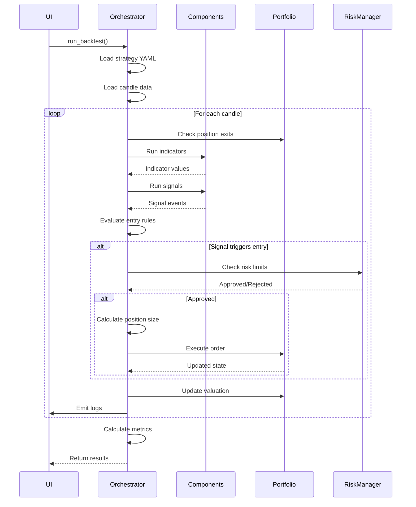

## Live Trading Flow

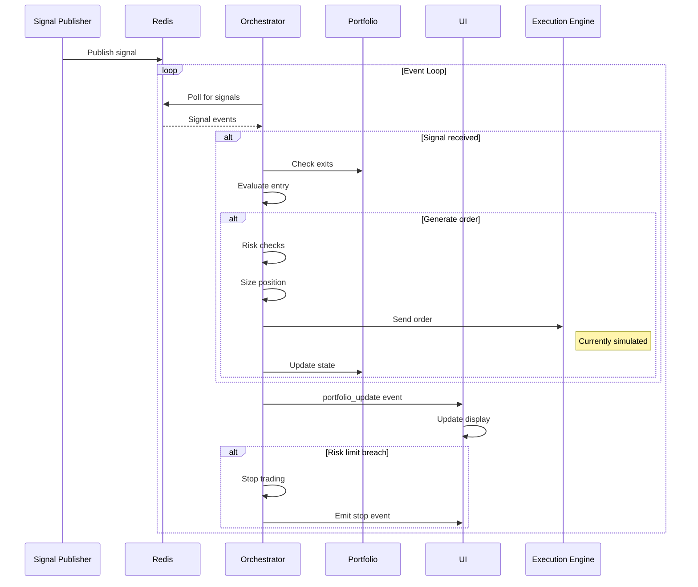

## Component Execution Flow

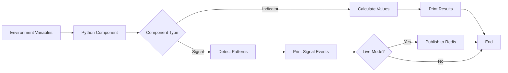

## Risk Management Decision Tree

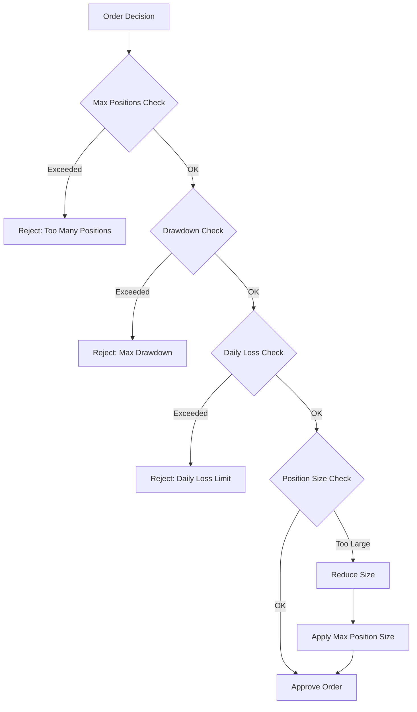

## Data Source Selection

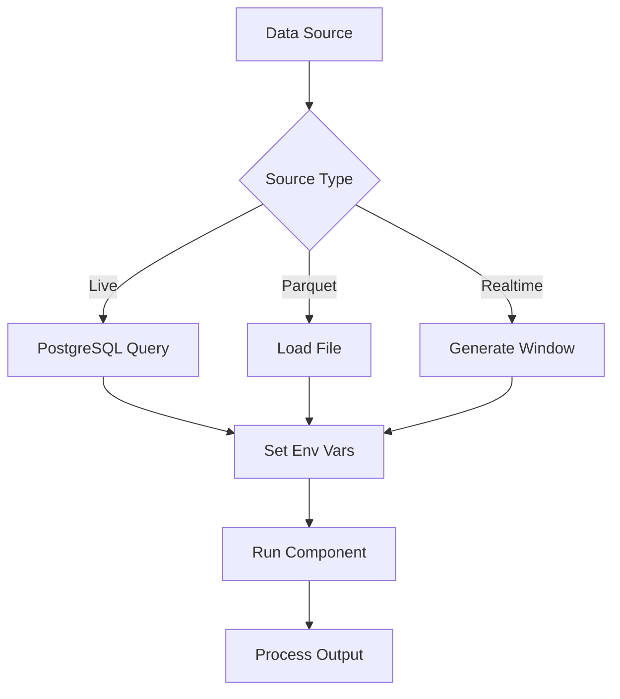

## Portfolio State Machine

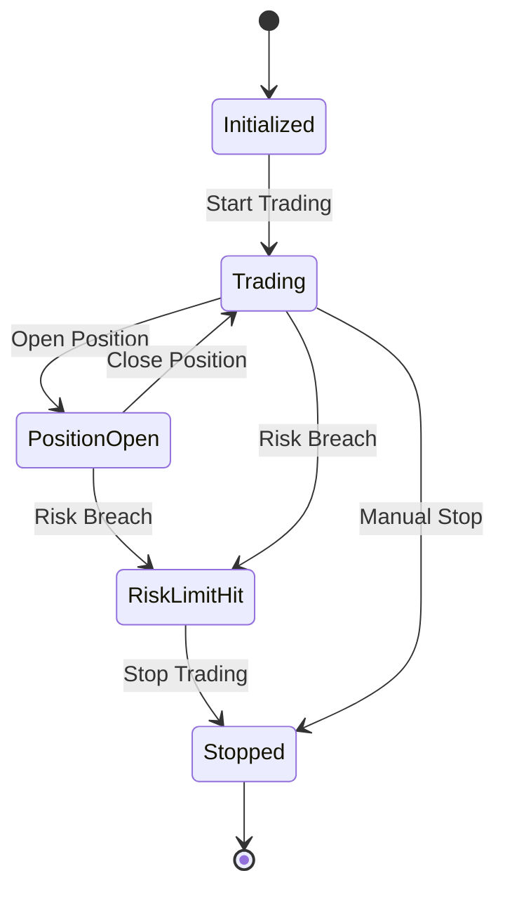

## Order Lifecycle

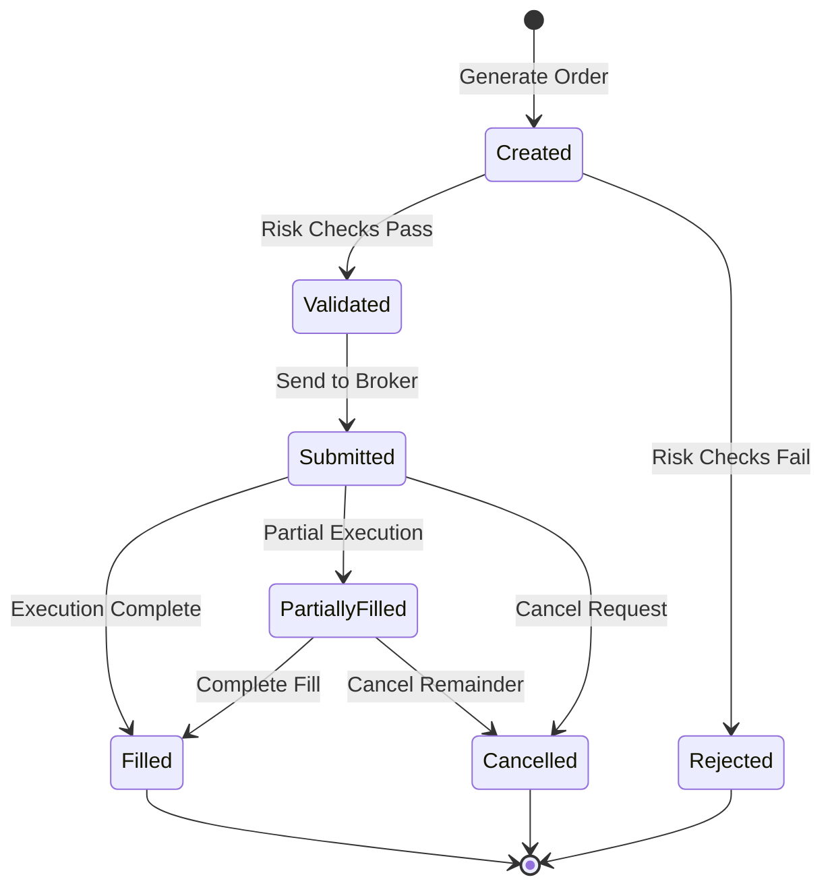

## Performance Tracking Flow

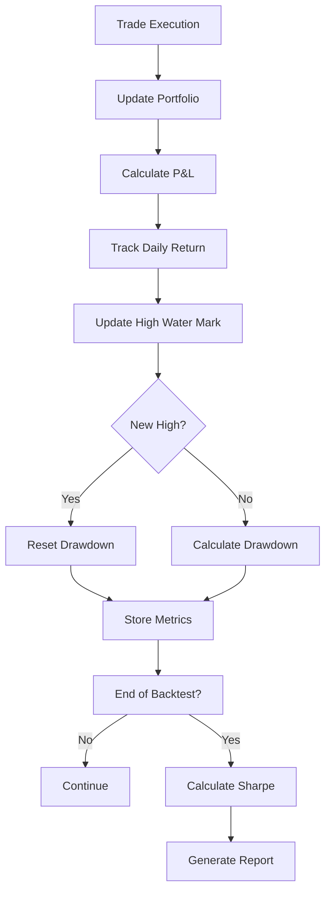

## Strategy Configuration Hierarchy

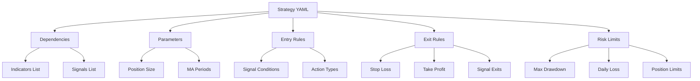

## Redis Stream Architecture

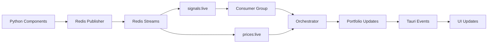

## Error Handling Flow

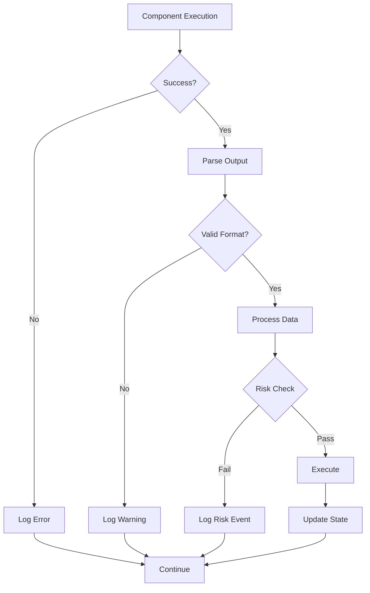

These diagrams provide a visual representation of the orchestrator's various flows and decision points, making it easier to understand the system's behavior and integration points.